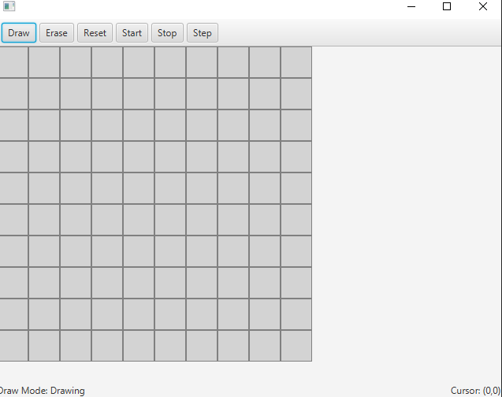

Game of life

Rules
The universe of the Game of Life is an infinite, two-dimensional orthogonal grid of square cells, each of which is in one of two possible states, live or dead (or populated and unpopulated, respectively). Every cell interacts with its eight neighbours, which are the cells that are horizontally, vertically, or diagonally adjacent. At each step in time, the following transitions occur:

1. Any live cell with fewer than two live neighbours dies, as if by underpopulation.
2. Any live cell with two or three live neighbours lives on to the next generation.
3. Any live cell with more than three live neighbours dies, as if by overpopulation.
4. Any dead cell with exactly three live neighbours becomes a live cell, as if by reproduction.

To start the game you run the GameOfLifeApplication and this board will show up.
You can then start to draw alive cells on the board.
If you press the erase button you can erase the cells that you have created.
You can then manually step through the generations by pressing the step button 
or you can press the start button and the generations will step through automatically.
You can also press step manually after the start button has been pressed to go through
the generations faster.
After you press start you can choose to stop the process by clicking the stop button.
You can press the reset button at any time to reset the board back to it's original state.

